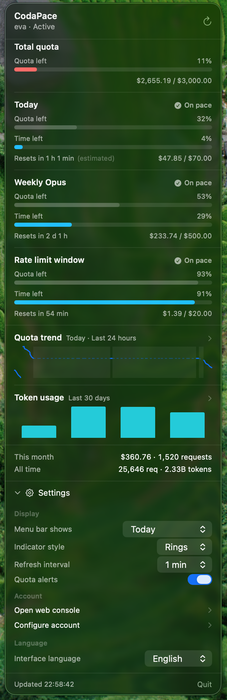

# CodaPace

[English](README.md) · **简体中文**

**知道自己撑不撑得到下一次重置。**

一个 macOS 菜单栏应用,盯的不只是「你花了多少」,而是「照这个速度,能不能撑到额度重置」。

> **前提:** CodaPace 从运行 [claude-relay-service](https://github.com/Wei-Shaw/claude-relay-service)
> 的中转站读取用量。它**用不了** Anthropic 官方 API、Bedrock、Vertex 或其他网关 ——
> 详见[系统要求](#系统要求)。

<p align="center">
  
</p>

---

## 为什么又一个用量监控

大多数用量工具回答的是「我用了多少」。这个数字本身**没法据以行动**:「剩余 61%」在你知道这段周期还剩多久之前毫无意义。早上九点看它很宽裕,晚上十一点看它无关紧要。

CodaPace 把两者并排放在一起:

```
pace = 剩余额度% − 剩余时间%
```

负数意味着你消耗得比时钟快 —— 会提前用完。这是一个**决策依据**,不是一个统计数字:它告诉你现在该不该开始那个大重构,还是等重置。

菜单栏同时承载两个维度:

| | |
|---|---|
| **数字** | 数量 —— 还剩多少 |
| **副标题** | 速率 —— *正常速度* / *超速* |
| **外环** | 剩余额度,按状态着色 |
| **内环** | 剩余时间 |

两个正交的事实。副标题从不复述数字 —— 而当某条额度没有重置周期(账户总额度)、速率无从谈起时,它会退回显示剩余金额,而不是硬凑一个算不出来的判断。

---

## 设计立场:不编造数据

这是最值得去读源码的部分。用量看板普遍会在空档处插值、给缺失的日子补零、把曲线抹平 —— 而读者根本分不清哪些是实测、哪些是装饰。CodaPace 一以贯之地拒绝这么做:

- **没有时间窗口就不做速度判断。** 账户总额度没有重置周期,那就干脆不给判断,而不是编一个。
- **空档画成阴影,绝不用实线连过去。** app 没运行的时段没有采样,中间发生了什么是真的不知道。
- **实线代表实测,虚线代表推断。** 两种视觉明确区分,各自只有一个含义。
- **重置处曲线直接断开。** 额度跳回满格是一个瞬时的、已知的事件,不是一段陡坡 —— 在那里画斜线等于暗示它是渐变过去的。
- **推断出来的重置时刻标注「(推算)」** —— 并且在 app 从历史中观测到一次真实重置后自动修正。
- **跨越 30 分钟以上空档的 token 增量直接丢弃。** 那段用量横跨的时间太长,归给任何一天都是猜的,所以宁可不计。
- **不限额度不画百分比。** 没有上限,就没有「剩余百分比」这回事。

代价是看得见的:图上会有洞,尤其是刚装上那几天。**那才是诚实的样子。**

---

## 功能

- 四条额度一览 —— 总额度、今日、本周 Opus、限流窗口,每条都带**真实金额**而不只是百分比
- 两种菜单栏样式:同心双环或堆叠横条
- 本地 SQLite 用量历史:额度曲线与按天 token 柱状图,另有可缩放的历史窗口
- 额度提醒(*额度不足* / *消费偏快*),**按重置周期去重**,所以 60 秒一次的刷新不会变成 60 秒一次的骚扰
- 状态从不只靠颜色传达 —— 每个状态都有图标或文字
- 简体中文、繁體中文、English,切换无需重启
- 倒计时每 30 秒本地重算一次,不依赖网络刷新

---

## 先例与致谢

CodaPace 相当程度上受惠于 [CodexMeter](https://github.com/raycalrui/CodexMeter) —— 一个监控 Codex 额度的菜单栏应用。它公开的设计文档同时塑造了本项目的界面和若干规则:

- **pace 这个想法本身** —— 用剩余额度对比剩余时间,而不是只报告消耗量。整个 app 都是围绕这个概念建起来的。
- 同心双环指示器,以及「拿不到重置时间就省略内环」这条规则。
- 用分隔线而非嵌套卡片来划分面板。
- 把纯逻辑拆成一个可独立测试的模块。
- 几个具体参数:15 分钟锚点采样、30 分钟空档阈值、20% 危险线、按重置周期去重通知。
- 用图标或文字而非颜色来传达状态。

**没有阅读也没有复制 CodexMeter 的任何源码** —— 只看了它公开的 README 和架构文档。这里的代码全部从零写起。

两者不是互相的替代品。CodexMeter 通过启动本地 `codex app-server` 子进程、经 stdio 走 JSON-RPC 来读取 Codex 额度;CodaPace 读的是 claude-relay-service 的 HTTP 接口。**任何一方都无法对接另一方的后端。**

CodaPace 自己走的路:

- **真实金额**而不只是百分比 —— 中转站接口会报告消费额,Codex 的不会
- **从历史中自学日重置时刻**,因为那个接口不提供,并在学到之前如实标注「(推算)」
- **区分两种不连续**:空档用虚线连接,因为中间未知;重置不连,因为那一跳是瞬时且已知的 —— 取而代之的是从边界处 100% 起的一段虚线,开启新周期
- **完全不依赖 Xcode 构建和测试**,直接用 `swiftc` 加一个小型的 XCTest 兼容测试框架

---

## 系统要求

- **macOS 13 及以上,仅 Apple Silicon。** 构建产物是 `arm64`,Intel Mac 无法运行。
- **一个运行 [claude-relay-service](https://github.com/Wei-Shaw/claude-relay-service) 的中转站。**

第二条才是关键。CodaPace 读取两个接口(`/apiStats/api/user-stats` 和
`/apiStats/api/batch-stats`),依赖该项目定义的响应结构。它**用不了**:

- Anthropic 官方 API —— 它没有对应的按 key 查额度的接口
- Amazon Bedrock 或 Google Vertex AI
- LiteLLM、OpenRouter 等其他网关,它们的用量接口结构不同

只有响应模型和这两个网络调用是特定于中转站的。其余部分 —— pace 计算、重置周期推算、历史存储、图表序列、告警策略 —— 都与服务商无关,并且位于一个可独立测试的模块中。

---

## 安装

### 从源码构建

```bash
git clone https://github.com/rigelmansid/CodaPace.git
cd CodaPace
./build.sh
open build/CodaPace.app
```

不需要 Xcode,Command Line Tools 就够。

自己编译出来的 app 可以正常双击打开 —— macOS 只会隔离从浏览器或其他机器传来的应用。

### 如果你拿到的是别人编译好的版本

构建产物是 **ad-hoc 签名、未经公证**的。从别处下载(而非本地编译)的 app 会带上隔离标记,Gatekeeper 会拒绝首次双击。**右键点击 → 打开 → 确认**即可,只需一次。要彻底消除这个摩擦需要 Developer ID 证书和公证,本项目没有。

### 配置

CodaPace 首次启动会自动弹出配置窗口。在浏览器里打开你的中转站用量统计页面,把完整地址复制进去:

```
https://你的中转站域名/admin-next/api-stats?apiId=…
```

保存前先点**「测试连接」** —— 它会真的发一次请求但不落盘,所以网址或 apiId 填错会当场报出来,而不是保存之后才发现菜单栏一直显示「离线」。

---

## 数据与隐私

- **CodaPace 只与一个主机通信:你填入的中转站地址。** 没有埋点,没有其他网络请求。
- **`apiId` 以明文存储**在 `~/Library/Preferences/com.hesher.codapace.plist`,和 baseURL 放在一起。它是一个**只读的统计标识**:既不能发起 API 请求,也拿不到你的 API Key。它曾经存在钥匙串里,但钥匙串的访问权限绑定代码签名身份,而 ad-hoc 签名**每次构建都会变** —— 结果是 macOS 每次启动都索要你的电脑密码。对一个未公证的应用来说,那个弹窗和恶意软件毫无区别,而它保护的东西并不值得这个代价。
- **历史数据存在本地**,位于 `~/Library/Application Support/CodaPace/History.sqlite`,按 `apiId` 的 SHA-256 分区,所以换 key 后历史互不干扰。**数据库里不会写入 apiId 原文。**

---

## 已知限制

- **历史从你安装那天开始。** 中转站接口只报告当前值,没有历史接口。不做任何回填。
- **app 没运行时没有采样。** 那些时段在图上显示为阴影空档。
- **日额度的重置时刻是推断的。** 接口不提供,所以 CodaPace 先假定为本地 0 点、标注「(推算)」,并在首次观测到计数器归零时学到真实时刻。
- **图表尚无悬停提示。** `chartXSelection` 需要 macOS 14;手写实现还没做。
- **限流窗口的超速提醒可能偏吵。** 该窗口每小时重置,去重键随之变化 —— 持续高负载理论上会每小时提醒一次。这条额度的**低额度**提醒值得保留(马上要被限流了),超速提醒大概不值得。尚未修复。
- **仅 Apple Silicon**,且**未经公证**。

---

## 开发

```bash
./build.sh                      # 构建 CodaPace.app
swift run CoreTests             # 119 个单元测试
swift Scripts/make-icon.swift   # 重新生成 Resources/AppIcon.icns
```

### 目录结构

```
Sources/Core/    纯逻辑 —— 不含 AppKit、不含 SwiftUI,完全可单测
Sources/App/     SwiftUI 视图、菜单栏绘制、网络、通知
Tests/CoreTests/ 测试框架与用例
Scripts/         图标生成器
```

`Package.swift` 只暴露 `Sources/Core`,因此逻辑可以脱离 UI 测试。`build.sh` 则把 `Core` 和 `App` 编译成同一个模块,两边共用同一份源码。

### 关于测试框架

Command Line Tools 不提供 `XCTest.framework`(它只随 Xcode 分发),所以本机跑不了 `swift test`。`Tests/CoreTests/TestSupport.swift` 提供了一套与 XCTest 同名同签名的断言函数,配合 `TestRegistry.swift` 里的显式用例清单。**测试用例的正文和标准 XCTest 写法完全一致**;该文件头部记录了将来装了 Xcode 后如何用四步切回去。

### 关于图标

`Scripts/make-icon.swift` 用 CoreGraphics 渲染图标,再由 `iconutil` 打包。所有尺寸都表达为画布边长的比例,因此从 16pt 到 1024pt 这十个尺寸是**同一份逻辑各自渲染**的,而不是把一张大图缩小 —— 这很重要,因为决定一个图标能不能用的是 32pt 和 16pt,不是 1024pt。

图形本身就是菜单栏指示器的放大版:外环表示额度、内环表示时间、内环线宽取外环的 80% —— 和 app 里用的是同一个比例。**你在程序坞里看到的和在菜单栏里看到的是同一个东西。**

---

## 许可

MIT
