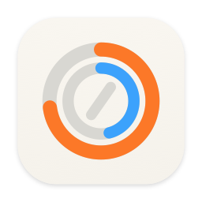
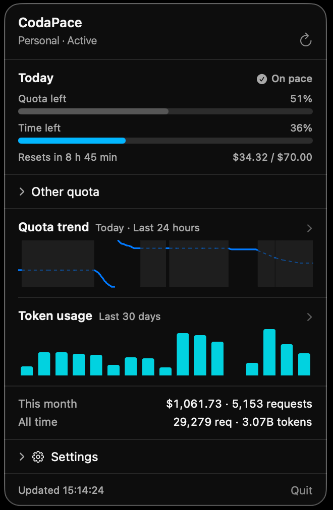
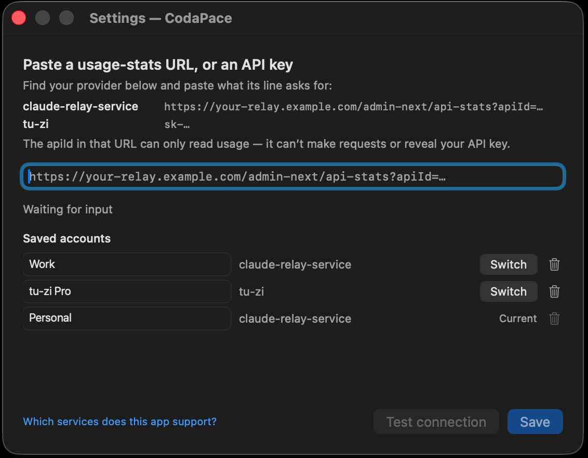
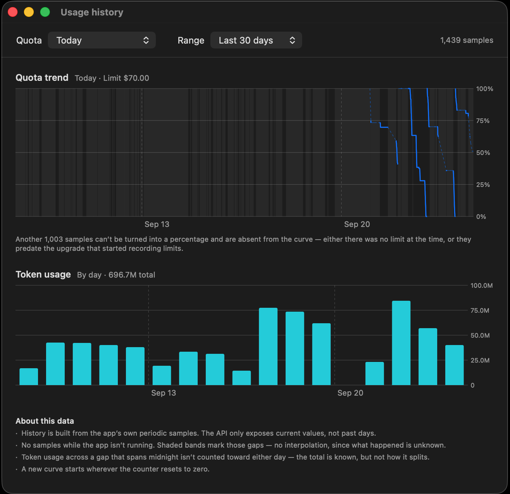

<div align="center">



# CodaPace

**知道自己撑不撑得到下一次重置。**

一个盯 API 额度的 macOS 菜单栏应用。它告诉你花了多少，也告诉你照这个速度，能不能撑到下次重置。

[](#安装)
[](#安装)
[](#开发)
[](https://github.com/rigelmansid/CodaPace/releases/latest)
[](LICENSE)

[English](README.md) · **简体中文**

</div>

<table>
  <tr>
    <th>菜单栏面板</th>
    <th>设置与已存档账户</th>
    <th>用量历史</th>
  </tr>
  <tr>
    <td></td>
    <td></td>
    <td></td>
  </tr>
</table>

截图为英文界面。

---

## 为什么是 CodaPace

- **看速度，不只看用量。** 「还剩 61%」本身说明不了什么，要看这个周期还剩多少时间。早上 9 点这很宽裕，
  晚上 11 点就无所谓了。CodaPace 把两者放在一起比：`pace = 剩余额度% − 剩余时间%`。为负就是会在重置前用完。
- **给的是决定，不是统计。** 这个判断告诉你：那个大重构是现在就开，还是等重置之后。
- **菜单栏里两个事实。** 数字是还剩多少，下面那行小字是用得快不快（*正常速度* / *超速*）。
  外环是额度，内环是时间。
- **不编造数据。** 空档就是空档，推算的会标出来，没有重置周期的额度就不给判断，而不是编一个。
  见[设计立场](#设计立场不编造数据)。

---

## 支持的服务

| 服务 | 粘贴什么 | 额度 | 凭据存在哪 |
|---|---|---|---|
| [claude-relay-service](https://github.com/Wei-Shaw/claude-relay-service) | 用量统计页面的网址，`https://your-relay.example.com/admin-next/api-stats?apiId=…` | 总额度、今日、本周 Opus、限流窗口 | 偏好设置。`apiId` 是只读标识，发不了请求 |
| [tu-zi Coding](https://api.tu-zi.com/) | 编程工具里填的服务地址，比如 `https://api.tu-zi.com/coding`，再粘 API Key（`sk-…`） | 今日、本周、本月 | macOS 钥匙串，因为这把 key 能花钱 |

**不支持** Anthropic 官方 API、Amazon Bedrock、Google Vertex AI，以及 LiteLLM、OpenRouter 这类网关。
它们的用量接口各不相同，官方 API 更是根本没有按 key 查额度的接口。

每个服务的对接都只在一个适配器文件里。pace 计算、重置推算、历史、图表、提醒这些全部共用。

---

## 功能

### 额度与速度
- 菜单栏显示的那条额度放在面板顶部，其余的收进「**其他额度**」
- 百分比之外还有真实金额
- 菜单栏可以固定显示某一条额度，也可以自动挑最紧的那条
- 倒计时每 30 秒在本地重算一次，不依赖网络刷新

### 多账户
- 「**测试连接**」通过的账户都可以存档，名字自己起
- 在设置窗口里切换已存档的账户。历史、学到的重置时刻、提醒记录都按账户分开存，切回来什么都不丢
- 删除存档会连同钥匙串里的 key 一起删掉，历史数据留在本机

### 历史
- 本地 SQLite 存历史：额度曲线和按天的 token 柱状图，窗口大小可调
- 可看最近 24 小时、7 天、14 天、30 天

### 菜单栏与提醒
- 两种样式：双环或横条
- 「额度不足」和「用得太快」两种提醒，按重置周期去重，60 秒一次的刷新不会变成 60 秒一条通知
- 状态从不只靠颜色表达，每种状态都有图标或文字
- 有新版本时，面板最下方出现一行提醒，点开是那一版的 Release 页面。只提醒，下载和安装由你自己来

### 语言
- 简体中文、繁体中文、English，切换不用重启

---

## 安装

### 命令行安装

三条命令：下载最新版，解压到「应用程序」，打开。

```bash
curl -fL -o /tmp/CodaPace.zip https://github.com/rigelmansid/CodaPace/releases/latest/download/CodaPace-arm64.zip
```

```bash
ditto -x -k /tmp/CodaPace.zip /Applications
```

```bash
open /Applications/CodaPace.app
```

这样装的副本不带隔离标记（`curl` 不给下载的文件打这个标记），所以打开时 macOS 不会拦。

升级时先退出 CodaPace、删掉旧版，再跑上面三条命令：

```bash
osascript -e 'quit app "CodaPace"'
rm -rf /Applications/CodaPace.app
```

`ditto` 是把文件合并进已有的 app，而不是整个替换，不删旧版可能留下旧版本的文件。
删掉 app 不会动你的账户、存档列表和历史，它们都存在 app 外面。

### 下载安装

从 [Releases](https://github.com/rigelmansid/CodaPace/releases/latest) 下载 `CodaPace-arm64.zip`，
解压后把 `CodaPace.app` 拖进「应用程序」。

发布版是 **ad-hoc 签名、未经公证**的，所以从浏览器下载的副本第一次打开会被拦：

1. **按住 Control 点按 app，选「打开」。** 有些 macOS 版本这样就够了。
2. 还是打不开的话，去「**系统设置 → 隐私与安全性**」，在关于 CodaPace 的提示旁点「**仍要打开**」，再启动一次。

每个副本只需要一次。用上面的命令行安装可以免掉这一步。

### 从源码构建

```bash
git clone https://github.com/rigelmansid/CodaPace.git
cd CodaPace
./build.sh
open build/CodaPace.app
```

有 Command Line Tools 就够，不需要 Xcode。自己构建的 app 不带隔离标记，可以直接打开。

### 首次设置

首次启动会打开设置窗口。按你那家服务那一行的提示粘贴（见[支持的服务](#支持的服务)），点「**测试连接**」。
它会真发一次请求、但什么都不保存，填错的网址或 key 当场就会报出来。然后点「**保存**」。
勾着「**同时存档**」就会把这个账户加进已存档列表。

---

## 设计立场：不编造数据

用量面板常常跨过空档插值、拿 0 补缺、把曲线抹平，而看的人分不出哪些是量出来的、哪些是装饰。
CodaPace 一贯拒绝这样做：

- **没有时间窗口就不给速度判断。** 没有重置周期的额度不显示判断。
- **空档画成阴影，绝不用实线连起来。** app 没运行的时候没有采样，中间发生了什么无从得知。
- **实线是观测到的，虚线是推算的。**
- **重置边界处曲线断开。** 额度跳回满格是一个瞬时、已知的事件，不是一段陡坡。
- **推算的重置时刻标注「（推算）」**，观测到真实的重置之后自动更正。
- **跨午夜的 token 用量不拆到两天。** 总量知道，怎么分不知道，所以记成「未归属」，而不是去猜。
  同一天之内的用量全部算在那一天。
- **不知道单位就不猜单位。** 服务没说数字是什么单位，就显示裸数字，不默认当成美元。

代价看得见：图表上有窟窿，刚开始用的时候尤其多。这才是如实的样子。

---

## 常见问题

<details>
<summary><b>macOS 提示无法打开这个 app</b></summary>

发布版没有经过公证。改用[命令行安装](#命令行安装)可以免掉这个提示，或者按[下载安装](#下载安装)里的两步操作。
</details>

<details>
<summary><b>切到 tu-zi 账户时，为什么 macOS 要我输密码？</b></summary>

那是钥匙串在问能不能让 CodaPace 读取存着的 key，点「**始终允许**」即可。
因为 app 是 ad-hoc 签名的，每个新版本在钥匙串看来都是一个新程序，所以每次升级后，每把存着的 key 会各问一次。
</details>

<details>
<summary><b>CodaPace 存了哪些数据，会发到哪里？</b></summary>

- **网络：** 访问你填的中转站网址，tu-zi 账户则访问 `coding.tu-zi.com`；另外每天访问一次 `api.github.com`
  检查有没有新版本。这个检查是匿名查询本项目的最新版本号，不带任何关于你或你账户的信息。
  没有统计上报，不连其他任何地址。
- **偏好设置**（`~/Library/Preferences/com.hesher.codapace.plist`）：中转站网址和 `apiId`、
  已存档账户列表（名字和标识，不含 key），以及显示设置。
- **钥匙串：** tu-zi 的 API Key，服务名为 `CodaPace`，只存在这台 Mac 上。
- **历史**（`~/Library/Application Support/CodaPace/History.sqlite`）：按「服务 + 账户标识」的哈希分区，
  原始标识从不写进数据库。
</details>

<details>
<summary><b>图表上为什么到处是空档？</b></summary>

历史是 app 自己定时采样攒出来的。这些服务只给当前值，所以安装之前的数据不存在，app 没运行的时段也没有记录。
这些时段画成阴影，不做填补。
</details>

<details>
<summary><b>重置时刻为什么标着「推算」？</b></summary>

claude-relay-service 不公布每天几点重置。CodaPace 先假定是本地零点，等观测到计数归零后，
记住这个账户真实的重置时刻。tu-zi 会直接告诉重置时刻，所以从来不需要推算。
</details>

<details>
<summary><b>能同时看两个账户吗？</b></summary>

不能。菜单栏只放得下一个数字，面板、历史、提醒也都跟着当前账户走。存档功能让切换变快，以此代替。
</details>

---

## 已知局限

- **历史从安装那天开始。** 不会补之前的数据。
- **app 没运行时没有采样。** 这些时段显示为阴影空档。
- **图表没有悬停提示。**
- **短周期额度的超速提醒可能重复。** 限流窗口每小时重置一次，持续高强度使用时可能每小时提醒一次。
- **只支持 Apple Silicon，未经公证**，且每次升级后钥匙串会再次询问（见常见问题）。

---

## 开发

```bash
./build.sh                      # 构建 CodaPace.app
swift run CoreTests             # 426 个单元测试
swift Scripts/make-icon.swift   # 重新生成 Resources/AppIcon.icns
```

<details>
<summary><b>目录结构</b></summary>

```
Sources/Core/    纯逻辑 —— 不依赖 AppKit / SwiftUI，全部有单元测试
Sources/App/     SwiftUI 视图、菜单栏绘制、网络、通知、钥匙串
Tests/CoreTests/ 测试框架与用例
Scripts/         图标生成器
docs/            项目须知与设计 backlog
```

`Package.swift` 只暴露 `Sources/Core`，所以逻辑可以脱离界面测试。`build.sh` 把 `Core` 和 `App` 编成同一个模块。
</details>

<details>
<summary><b>关于测试框架</b></summary>

Command Line Tools 不带 `XCTest.framework`（它只随 Xcode 分发），所以 `swift test` 跑不了。
`Tests/CoreTests/TestSupport.swift` 提供了和 XCTest 同名同签名的断言函数，外加 `TestRegistry.swift` 里的显式登记。
测试用例的写法和在 XCTest 下完全一样。
</details>

<details>
<summary><b>图标</b></summary>

`Scripts/make-icon.swift` 用 CoreGraphics 按 sRGB 绘制图标，再用 `iconutil` 打包。所有尺寸都表示为画布边长的比例，
所以从 16 到 1024 像素的十个尺寸都是同一套逻辑画出来的，不是把一张大图缩小。
图形就是菜单栏指示器的放大版：外环是额度，内环是时间。
</details>

---

## 致谢与参考

CodaPace 在很大程度上受益于 [CodexMeter](https://github.com/raycalrui/CodexMeter)，一个监控 Codex 额度的菜单栏应用。
它公开的设计说明影响了本应用的界面和好几条规则：

- **pace 这个想法本身**，拿剩余额度和剩余时间做比较。整个应用都是围绕它建的。
- 双同心环指示器，以及重置时刻未知时省略内环。
- 面板用分隔线划分区域，而不是层层嵌套的卡片。
- 把纯逻辑拆成可以单独测试的模块。
- 具体参数：15 分钟锚点采样、30 分钟空档阈值、20% 危险线、按重置周期对提醒去重。
- 状态用图标或文字表达，不只靠颜色。

**没有阅读或复制过 CodexMeter 的任何源码**，只参考了它公开的 README 和架构说明。这里的一切都是从零写的。
两个应用读的是不同的后端，不能互相替代。

CodaPace 自己走的路：显示真实金额、从观测历史里学出每天的重置时刻、区分空档（中间未知，用虚线桥接）和重置
（瞬时且已知的跳变）、用同一套适配器接口接入多个服务，以及不用 Xcode 构建。

---

## 许可证

[MIT](LICENSE)
